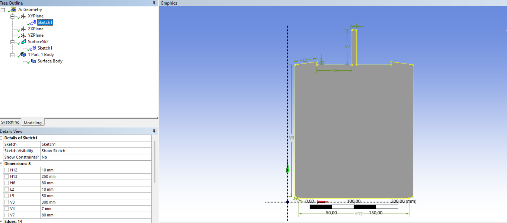
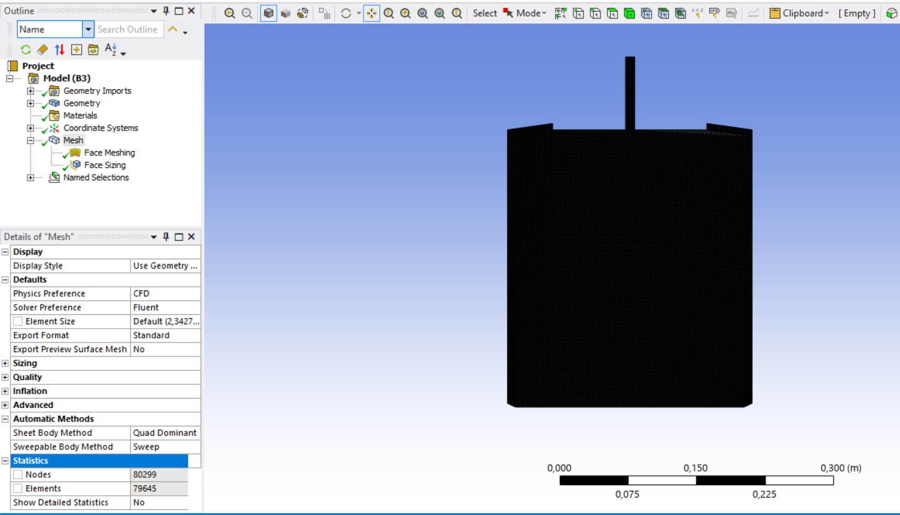
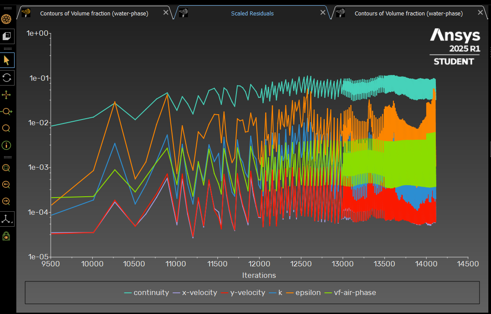
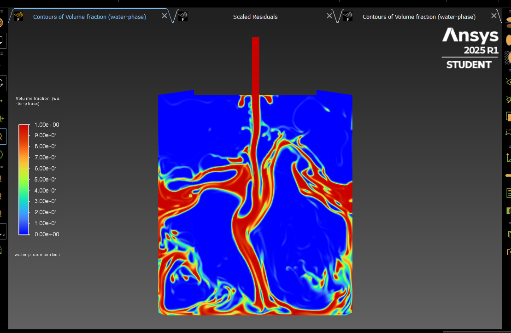

# Two-Phase-Air-Water-Transient-CFD-Simulation

# Air-Water Two-Phase Flow (VOF Transient CFD Simulation)

2D transient CFD simulation of an **air-water two-phase flow** using **ANSYS Fluent**.  
The study models the interaction between air and water under gravity using the **Volume of Fluid (VOF)** multiphase approach.

---

## 🌊 Geometry and Setup

- **Domain:** 2D planar geometry  
- **Solver Type:** Pressure-based, transient  
- **Gravity:** Enabled (9.81 m/s², downward)  
- **Turbulence model:** Realizable *k–ε*  
- **Multiphase model:** Volume of Fluid (VOF)  
- **Number of Eulerian Phases:** 2 (Air and Water)  
- **Body Force Formulation:** Implicit  
- **Mesh:** ~80,000 elements (structured)

### 🧱 Phases and Materials
- **Phase 1:** *Water-liquid* (from Fluent materials database)  
- **Phase 2:** *Air* (from Fluent materials database)  
- **Surface tension coefficient:** Constant, **0.072 N/m**  
  - Represents the natural interfacial tension between air and water under standard conditions.  
- **Continuum Surface Force (CSF) model:** Enabled to include surface tension forces at the interface.

---

## 💨 Boundary Conditions

- **Inlet:**  
  - Type: *Pressure Inlet*  
  - *Gauge Pressure:* **450 Pa** (pressurized air injection)  
  - *Phase:* Air  
  - Rationale: Air is injected into the domain by pressure difference, pushing the interface dynamically.

- **Outlet:**  
  - Type: *Pressure Outlet*  
  - *Phase:* Air  
  - *Backflow phase:* Air  
  - Ensures stable pressure discharge and prevents unwanted phase mixing at the exit.

- **Operating Conditions:**  
  - User-defined density: **1.225 kg/m³**  
  - Represents air density at standard atmospheric conditions.

---

## ⚙️ Numerical Methods

- **Pressure–Velocity Coupling:** PISO  
- **Pressure Discretization:** Body Force Weighted  
- **Body Force Formulation:** Implicit (used for stable coupling between pressure and body forces in multiphase simulations)  
- **Initialization:**  
  - Standard initialization from *inlet*  
  - All velocities = 0 m/s  
  - Air phase volume fraction = 1 (air initially fills the domain)

### 🧩 Patch Operation
After initialization, a **patch** was applied to assign the *air phase volume fraction* on a defined surface region.  
This operation defines which zones are initially filled with air vs. water — effectively setting up the initial interface location.

---

## 🧱 Mesh and Geometry

The 2D geometry was meshed with approximately **80,000 elements**, refined near the expected air–water interface region to accurately capture the transition.

  

---

## 🧭 Solver Stability and Residuals

Solver residuals were monitored for each iteration.  
Stable convergence was observed after transient stabilization, validating the PISO–VOF configuration.

---

## 🌫️ Flow Interface Evolution

The **VOF model** effectively captured the deformation and movement of the interface between the two immiscible fluids (air and water).  
The pressure-driven air inflow displaces the water phase, producing realistic interface motion and surface curvature due to surface tension effects.

### Contour of Water Phase Volume Fraction

---

## 🎞️ Animation

Time evolution of the air–water interface:

---

## 💡 Observations

- The **VOF multiphase model** successfully resolves the distinct interface between air and water.  
- **Pressure inlet (450 Pa)** introduces air that compresses and displaces the water surface dynamically.  
- The **implicit body force formulation** enhances stability by treating gravity and pressure gradients simultaneously in the momentum equation.  
- **Surface tension (0.072 N/m)** ensures realistic curvature and smoothness at the interface boundary.  
- The **patch method** allowed defining an initial air region precisely, setting the starting interface position.  
- The simulation captures characteristic VOF behavior:  
  gradual interface deformation, mixing regions near boundaries, and residual stabilization over transient time steps.

---

## 📂 Files Included

| File | Description |
|------|--------------|
| `geometry.png` | Geometry of the computational domain |
| `80k_mesh.png` | 2D mesh used in the simulation |
| `scaled_residuals.png` | Residuals during transient solution |
| `volume_fraction_water_phase_contour.png` | Water phase volume fraction contour |
| `water-phase-animation.gif` | Animation showing air–water interface evolution |

---

## 🧮 Conclusion

This simulation represents the user’s **first successful two-phase air–water CFD project**.  
Using ANSYS Fluent’s **VOF model**, the transient pressure-driven interaction between air and water was accurately modeled.  
The setup validated multiphase modeling fundamentals — including interface tracking, surface tension dynamics, and gravity coupling.
