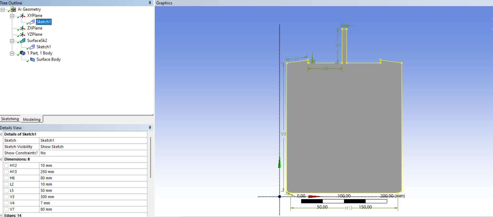
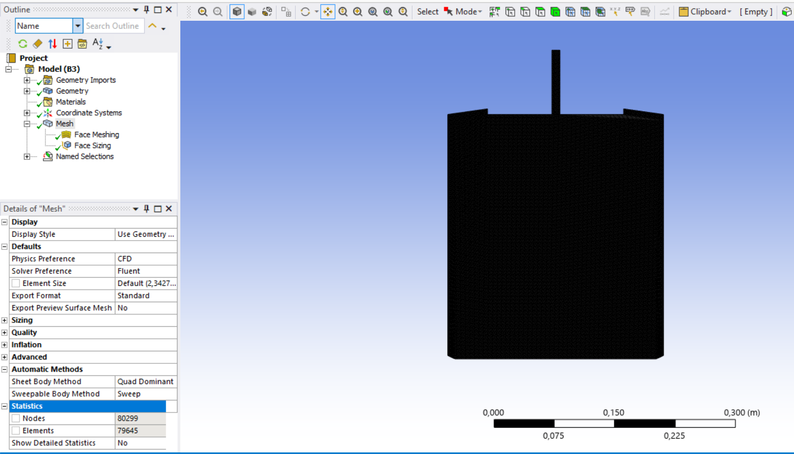
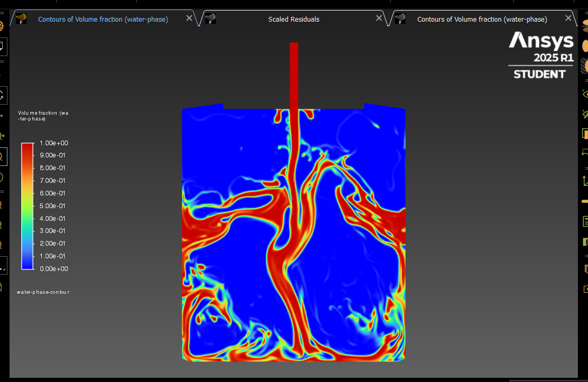
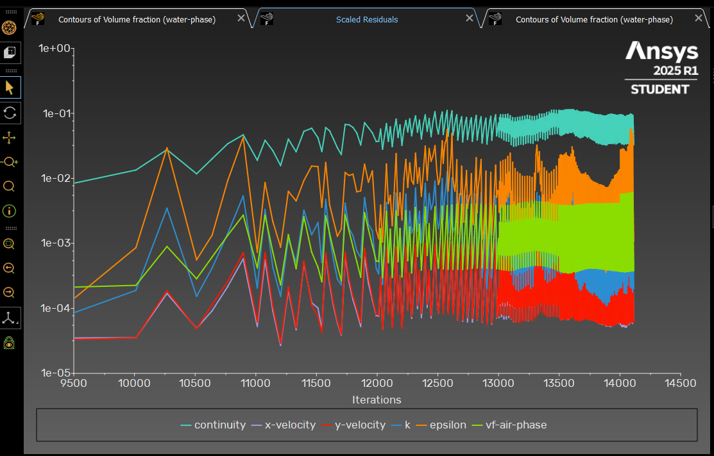

# Air–Water Two-Phase Flow: Transient VOF Simulation

**2D transient CFD simulation of pressure-driven air–water interface dynamics in ANSYS Fluent, using the Volume of Fluid (VOF) method with surface tension.**

*Evolution of the water volume fraction: pressurised air entering the domain displaces the water.*

---

## Setup

| Item | Setting |
|---|---|
| **Domain** | 2D planar |
| **Mesh** | ≈ 80,000 structured cells, refined around the expected interface |
| **Solver** | Pressure-based, transient |
| **Multiphase model** | VOF, 2 phases (water-liquid, air), implicit body force |
| **Surface tension** | 0.072 N/m, Continuum Surface Force (CSF) model |
| **Turbulence** | Realizable k-ε |
| **Gravity** | 9.81 m/s², downward |
| **Operating density** | 1.225 kg/m³ (air) |

### Boundary conditions

| Boundary | Type | Settings |
|---|---|---|
| Inlet | Pressure inlet | 450 Pa gauge, air |
| Outlet | Pressure outlet | Backflow phase: air |

### Numerical methods and initialisation

- **Pressure–velocity coupling:** PISO
- **Pressure discretisation:** Body Force Weighted
- **Initialisation:** standard, from inlet, all velocities zero and domain filled with air. The initial water region was then set with a **patch** of the volume fraction.

| Geometry | Mesh |
|:---:|:---:|
|  |  |

---

## Results

| Water volume fraction | Scaled residuals |
|:---:|:---:|
|  |  |

### Observations

- The VOF model keeps a sharp interface between the two immiscible phases.
- The 450 Pa pressure inlet drives air into the domain. The air displaces and deforms the water surface.
- Surface tension (CSF) gives smooth, physically realistic curvature at the interface.
- The implicit body force formulation, together with Body Force Weighted pressure discretisation, keeps the gravity-dominated two-phase flow stable.
- Residuals stabilise once the initial transient has passed.

---

## Repository Contents

| File | Description |
|---|---|
| `geometry.png` | Computational domain |
| `80k_mesh.png` | Mesh |
| `scaled_residuals.png` | Residual history |
| `volume_fraction_water_phase_contour.png` | Water volume fraction contour |
| `volume_fraction_water_phase_contour.gif`, `volume_fraction_water_phase_contourrr.gif` | Interface evolution animations |

## Author

**Burak Yörükçü** · [GitHub](https://github.com/CFDBY) · burakyorukcu@outlook.com
